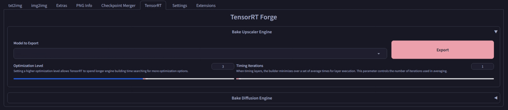

# SD Forge TensorRT
This is an Extension for [Forge Neo](https://github.com/Haoming02/sd-webui-forge-classic/tree/neo), which implements **TensorRT** to achieve blazingly-fast inference.

> [!Important]
> Currently only **Upscaler** is supported ; **Diffusion Model** is ~~hopefully~~ coming soon... :tm:

## How to Use

1. Open the new **TensorRT** tab
2. Select an Upscaler
3. Click `Export` to convert the model into TensorRT engine
    - `Tile Size` is based on the option in **Settings/Upscaling**
4. Click `Reload UI`
5. The converted engine should show up in the Upscaler dropdown

> [!Warning]
> Currently, some Upscaler produces artifacts and incorrect color...

> [!Tip]
> Use a low `Optimization Level` to see if the model actually works first

## Benchmark

- Running `2x-AnimeSharpV4_RCAN` on **RTX 3060**

<table>
	<tr align="center">
		<th><b>fp32</b> (CPU Composite)</th>
		<th><b>fp32</b> TensorRT</th>
		<th><b>fp16</b> (GPU Composite)</th>
	</tr>
	<tr align="center">
		<td>2.91 it/s</td>
		<td>4.34 it/s</td>
		<td>5.23 it/s</td>
	</tr>
</table>

### References
- https://github.com/NVIDIA/Stable-Diffusion-WebUI-TensorRT
- https://github.com/yuvraj108c/ComfyUI-Upscaler-Tensorrt
- https://github.com/comfyanonymous/ComfyUI_TensorRT

### Resources
- https://docs.nvidia.com/deeplearning/tensorrt/latest/_static/python-api/index.html
